- [NXP Platform Accelerator for MCXN947 Freedom board v1.0.0](#nxp-platform-accelerator-for-mcxn947-freedom-board-v100)
  - [MicroEJ SDK 6](#microej-sdk-6)
  - [MicroEJ SDK 5](#microej-sdk-5)
  - [VEE Port Specifications](#vee-port-specifications)
  - [Requirements](#requirements)
  - [Directory structure](#directory-structure)
  - [Preliminary steps](#preliminary-steps)
    - [Get West](#get-west)
    - [Get the MicroEJ SDK](#get-the-microej-sdk)
    - [Get Visual Studio Code](#get-visual-studio-code)
    - [Get GNU ARM Embedded Toolchain](#get-gnu-arm-embedded-toolchain)
  - [Fetch the source code](#fetch-the-source-code)
    - [West : `PermissionError: \[WinError 5\] Access is denied`](#west--permissionerror-winerror-5-access-is-denied)
  - [MicroEJ IDE project setup](#microej-ide-project-setup)
    - [Import the project in a new workspace](#import-the-project-in-a-new-workspace)
    - [Build the VEE Port](#build-the-vee-port)
  - [Build and run applications using the MicroEJ SDK IDE](#build-and-run-applications-using-the-microej-sdk-ide)
    - [Build and run the applications in simulation mode](#build-and-run-the-applications-in-simulation-mode)
  - [Build and run applications on your MCXN947 Freedom board](#build-and-run-applications-on-your-mcxn947-freedom-board)
    - [Get an evaluation license](#get-an-evaluation-license)
    - [Build the applications for target](#build-the-applications-for-target)
    - [Build the firmware for target hardware using VS Code](#build-the-firmware-for-target-hardware-using-vs-code)
  - [Switching to a production license](#switching-to-a-production-license)
  - [Alternative: build and run from command line](#alternative-build-and-run-from-command-line)
    - [Requirements for building from command line](#requirements-for-building-from-command-line)
    - [Populate a Build Kit](#populate-a-build-kit)
    - [Using default evaluation license](#using-default-evaluation-license)
    - [Needed Environment variables](#needed-environment-variables)
    - [Explore available options (works on Linux)](#explore-available-options-works-on-linux)
    - [compile and flash](#compile-and-flash)
    - [Compilation defaults](#compilation-defaults)
    - [compile with just NET support enabled](#compile-with-just-net-support-enabled)
    - [compile Ai demo](#compile-ai-demo-1)
    - [debug](#debug)
    - [Ninja](#ninja)
    - [Compile Release image](#compile-release-image)
    - [Compile using production license](#compile-using-production-license)
    - [Compiling using west](#compiling-using-west)
  - [Tutorial: Using native C functions from the high level application](#tutorial-using-native-c-functions-from-the-high-level-application)
    - [Declaring and using native functions in the Java world](#declaring-and-using-native-functions-in-the-java-world)
    - [Implementing the native functions in C world](#implementing-the-native-functions-in-c-world)
    - [Implementing a mockup of the native functions for the simulator](#implementing-a-mockup-of-the-native-functions-for-the-simulator)
  - [Get familiar with MICROEJ](#get-familiar-with-microej)
    - [Examples](#examples)
    - [MICROEJ Documentation](#microej-documentation)
  - [Troubleshooting](#troubleshooting)
    - [License Error when building application](#license-error-when-building-application)
# NXP Platform Accelerator for MCXN947 Freedom board v1.0.0
This project is used to build NXP Platform Accelerator for the [MCXN947 Freedom board](https://www.nxp.com/design/design-center/development-boards/general-purpose-mcus/frdm-development-board-for-mcx-n94-n54-mcus:FRDM-MCXN947) with a display panel [LCD_PAR_S035](https://www.nxp.com/design/design-center/development-boards/general-purpose-mcus/3-5-480x320-ips-tft-lcd-module:LCD-PAR-S035).


NXP Platform Accelerator a VEE (Virtual Execution Environment) and provides a hardware abstraction to develop applications in high-level programming languages such as Java.

NXP Platform Accelerator is built upon [MicroEJ technology](https://www.microej.com/product/vee/).

This release includes:

* MCXN947 Freedom board simulator to develop VEE applications and test them on a host PC
    * The simulator program has a graphic display of the EVK board and its LCD panel
* The necessary recipes to embed the VEE architecture for GCC
* Various [Foundation Libraries](https://docs.microej.com/en/latest/ApplicationDeveloperGuide/libraries.html) to provide high level libraries to developers
* Notable Foundation Libraries part of this release are:
    * [MicroUI](https://docs.microej.com/en/latest/ApplicationDeveloperGuide/UI/MicroUI/index.html#section-app-microui) to create user interfaces


    * [Networking](https://docs.microej.com/en/latest/ApplicationDeveloperGuide/networkingFoundationLibraries.html)


    * [AI](https://forge.microej.com/ui/native/microej-developer-repository-release/com/nxp/api/ai/1.0.0/): AI / Machine Learning library based on TensorFlowLite


    * [GPIO](https://forge.microej.com/ui/native/microej-developer-repository-release/com/nxp/api/gpio/1.0.0/)

* [MCUXpresso SDK](https://mcuxpresso.nxp.com/en/welcome) 2.14.0 MCXNx4x for MCXN947 Freedom board
* [FreeRTOS](https://www.freertos.org/index.html) version 10.5.0
* Sample applications demonstrating NXP VEE:

    * SimpleGFX: draw moving NXP coloured boxes using MicroUI


    * AI_Cifarnet_Demo: runs an inference of CifarNet quantized TensorFlow model on sample images 


    * Compatible with the [MQTT Demo application](https://repository.microej.com/packages/documentation/cinterion-vee/1.8/getting-started/demo/index.html) of MicroEJ

* [Mock](https://docs.microej.com/en/latest/PlatformDeveloperGuide/mock.html) support with Java stub implementations to mimick C native functions. Thanks to this mock support, the SimpleGFX application can smoothly run on the simulator

## MicroEJ SDK 6

NXP Platform Accelerator is built on MicroEJ technology.

MicroEJ SDK 6 is the latest available MicroEJ SDK.
The SDK 6 uses Gradle plugin to compile and package MicroEJ modules.
It allows the user to use his favourite IDE such as Android Studio or IntelliJ IDEA (see [the list of supported IDE](https://docs.microej.com/en/latest/SDK6UserGuide/install.html#install-the-ide)).

SDK 6 is currently limited to the build, test and simulation of **Applications and Add-on Libraries** (see [Scope and Limitations](https://docs.microej.com/en/latest/SDK6UserGuide/limitations.html#sdk-6-limitations) for more information).
If you need other features, such as **developping a VEE Port**, you have to use the SDK 5.

If you are an application developer only and do not need to make changes to the VEE Port, you can use the SDK 6. Please click on the button below to access to the SDK 6 Getting Started on the MCXN947 Freedom board.

[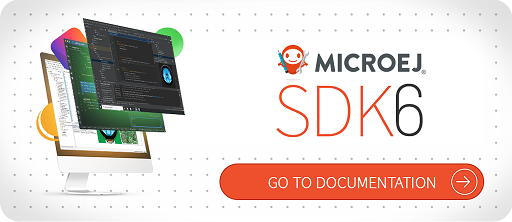](https://docs.microej.com/en/latest/SDK6UserGuide/gettingStartedIMXRT1170.html)

## MicroEJ SDK 5

If you want to modify the VEE Port, make changes to low level source code, please use SDK 5 and continue following this README.


## VEE Port Specifications
The architecture version is ```8.1.0```.

This VEE Port provides the following Foundation Libraries:

|Foundation Library|Version|
|------------------|-------|
|AI       |1.0|
|BON      |1.4|
|DEVICE   |1.2|
|DRAWING  |1.0|
|EDC      |1.3|
|FS       |2.1|
|GPIO     |1.0|
|MICROUI  |3.1|
|NET      |1.1|
|SECURITY |1.4|
|SNI      |1.4.0|
|SSL      |2.2|
|TRACE    |1.1|


## Requirements
* PC with Windows 10 or higher, or Linux (tested on Debian 11)
    * Note for Mac users: this documentation does not cover Mac usage, however it is supported by the MicroEJ tools. If you are interested in Mac support, please [contact MicroEJ](https://www.microej.com/contact/#form_2).
* Java JDK 11 see [Get the MicroEJ SDK](#get-the-microej-sdk) section
* [West](https://docs.zephyrproject.org/latest/develop/west/install.html), a meta-tool to handle git dependencies
* Internet connection to [MicroEJ Central Repository](https://developer.microej.com/central-repository/)
* MCXN947 Freedom board board, available [here](https://www.nxp.com/design/design-center/development-boards/general-purpose-mcus/frdm-development-board-for-mcx-n94-n54-mcus:FRDM-MCXN947)
* LCD_PAR_S035 display panel, available [here](https://www.nxp.com/design/design-center/development-boards/general-purpose-mcus/3-5-480x320-ips-tft-lcd-module:LCD-PAR-S035)
* Optionally: J-Link Debugger to flash the software


## Directory structure
```
[...]
├── bsp
│   └── projects
│       ├── common
│       ├── microej
│       └── nxpvee-ui
├── CHANGELOG.md
├── cmake
├── CMakeLists.txt
├── Documentation
├── Licenses
├── LICENSE.txt
├── Makefile
├── Makefile.inc
├── microej
│   ├── apps
│   ├── front-panel
│   ├── MCXN947-frdm_platform-CM4hardfp_GCC48-1.0.0
│   ├── mock
│   ├── validation
│   └── vee-port-configuration
├── README.md
├── scripts
├── SCR-nxpvee-mcxn947-frdm.txt
└── west.yml
```


## Preliminary steps

### Get West
[West](https://docs.zephyrproject.org/latest/develop/west/index.html) is Zephyr's meta-tool that supports multiple repository management. Examples are provided later in this documentation on how to use West to fetch the code and dependencies.

Install West by following [Installing west](https://docs.zephyrproject.org/latest/develop/west/install.html) instructions.

### Get the MicroEJ SDK
The MICROEJ SDK is an Eclipse-based IDE used to build the VEE Port and the high-level applications. The SDK can be used to run the MCXN947 Freedom board simulator.

The MICROEJ SDK requires Java JDK. JDK version [depends on the MICROEJ SDK version](https://docs.microej.com/en/latest/SDKUserGuide/systemRequirements.html).

* Install the JDK. You can download it on the [Java SE 11](https://www.oracle.com/java/technologies/downloads/#java11) page
* Install MICROEJ SDK 23.07. Please refer to [Download and Install – MicroEJ Documentation](https://docs.microej.com/en/latest/SDKUserGuide/installSDKDistributionLatest.html#) and [Installer Repository](https://repository.microej.com/packages/SDK/23.07/)

This release has been tested with MicroEJ SDK 23.07 and Java JDK 11.

### Get Visual Studio Code
VS Code is an IDE used to build, flash and debug embedded projects.

In this VEE Port release, VS Code is used to build the firmware that will be flashed to target. VS Code project uses the VEE Port and high level applications built by the MicroEJ SDK.

* You can download VS Code IDE [here](https://code.visualstudio.com/download).
* Start VS Code and install the [MCUXpresso for VS Code](https://www.nxp.com/design/software/development-software/mcuxpresso-software-and-tools-/mcuxpresso-for-visual-studio-code:MCUXPRESSO-VSC?tid=vanMCUXPRESSO-VSC) extension package.
* Install the [MCUXpresso VS Code package dependencies](https://github.com/nxp-mcuxpresso/vscode-for-mcux/wiki/Dependency-Installation) to support the full development flow.

### Get GNU ARM Embedded Toolchain
To build an image that runs on target, you need a Cortex-M toolchain.
The [GNU ARM Embedded Toolchain](https://developer.arm.com/downloads/-/gnu-rm) is used to validate this release.

**Toolchain for Linux**: [gcc-arm-none-eabi-10.3-2021.10-x86_64-linux.tar.bz2](https://developer.arm.com/-/media/Files/downloads/gnu-rm/10.3-2021.10/gcc-arm-none-eabi-10.3-2021.10-x86_64-linux.tar.bz2?rev=78196d3461ba4c9089a67b5f33edf82a&hash=D484B37FF37D6FC3597EBE2877FB666A41D5253B)

**Toolchain for Windows**: [gcc-arm-none-eabi-10.3-2021.10-win32.exe](https://developer.arm.com/-/media/Files/downloads/gnu-rm/10.3-2021.10/gcc-arm-none-eabi-10.3-2021.10-win32.exe?rev=29bb46cfa0434fbda93abb33c1d480e6&hash=3C58D05EA5D32EF127B9E4D13B3244D26188713C)

Once installed, the following environment variable must be set to point to the toolchain directory:

Linux:

* Open ` ~/.bashrc` file.
* Add the following line at the end of the file:

```
export ARMGCC_DIR=/opt/gcc-arm-none-eabi-10.3-2021.10/
```

Windows:

* Open the `Edit the system environment variables` application on Windows.
* Click on the `Environment Variables…` button.
* Click on the `New…` button under the `User variables` section.
* Set `Variable` Name to `ARMGCC_DIR`.
* Set `Variable Value` to the toolchain directory (e.g. `C:\Program Files (x86)\GNU Arm Embedded Toolchain\10 2021.10`).
* Click on the `Ok` button until it closes `Edit the system environment variables` application.


## Fetch the source code

On Windows, fetching the source code may trigger the following fatal error:
```error: unable to create file [...]: Filename too long.```
To avoid this, git configuration needs to be updated to handle long file names:

Start Git Bash as Administrator.

Run following command:
```git config --system core.longpaths true```

Clone the repository with the following command:

```
mkdir  nxp-vee-mcxn947-frdm
cd nxp-vee-mcxn947-frdm
west init -m https://github.com/nxp-mcuxpresso/nxp-vee-mcxn947-frdm.git .
west update
```
you will get

```
.west nxp-vee-mcxn947-frdm
```
### West : `PermissionError: [WinError 5] Access is denied`

If you get the error `PermissionError: [WinError 5] Access is denied`, please consider the following procedure :

```
rm .west
cd nxp-vee-mcxn947-frdm
west init -l
cd ..
west update
```

## MicroEJ IDE project setup
### Import the project in a new workspace
Launch MicroEJ SDK and create a blank workspace.

Import the cloned repository as an existing project:


Then select all projects from the repository.

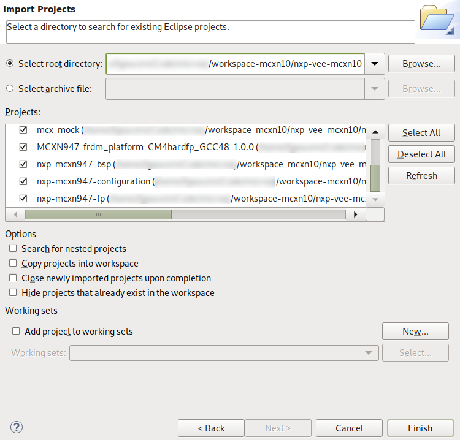

The package explorer view should look like this:

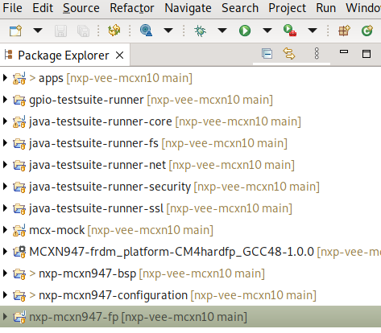

### Build the VEE Port
The VEE Port for the board is the first thing to build with the IDE.
For demonstration purposes, one of the release examples uses a mockup (more details follow in the native functions description). 
The mockup is a dependency of the VEE Port and must therefore be built beforehand.


#### Build the mockup
Right click on the mockup project and select `Build Module`:

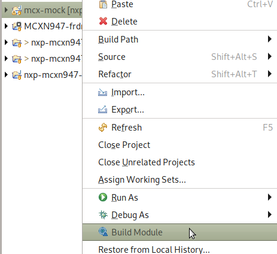

#### <a name="build-the-vee-port"></a> Build the VEE Port
Once the mockup dependency is resolved, the VEE Port can be built by using [VEE Port Build](https://docs.microej.com/en/latest/VEEPortingGuide/platformCreation.html#platform-build) instructions.
Right-click on the configuration project and select `Build Module`:

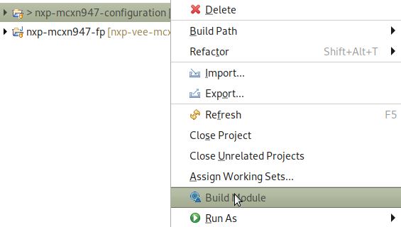

Building the platform will populate the initally empty `MCXN947-frdm_platform-CM4hardfp_GCC48-1.0.0` project which will be used to build VEE applications.
Under the `source` folder of the VEE Port, you will find the following files: 
* The C header files of the native needed by the VEE Port libraries are located in the `include` folder.
* The Java API of the VEE Port libraries is located in the `javaAPIS` folder.
* The jar files of the VEE Port libraries are located in the `javaLibs` folder.
* The Simulation files are located in the `S3` and `mocks` folders. 
* The VEE core, the MicroJVM, and some tools.

## Build and run applications using the MicroEJ SDK IDE

This release comes with an example VEE application.


Application `SimpleGFX` displays three moving rectangles using the [MicroUI API](https://docs.microej.com/en/latest/ApplicationDeveloperGuide/UI/MicroUI/index.html#section-app-microui). The coordinates of the rectangles are calculated in C native functions.


### Build and run the applications in simulation mode
To run applications in simulation mode, right-click on the apps project and select `Run As -> MicroEJ Application`:

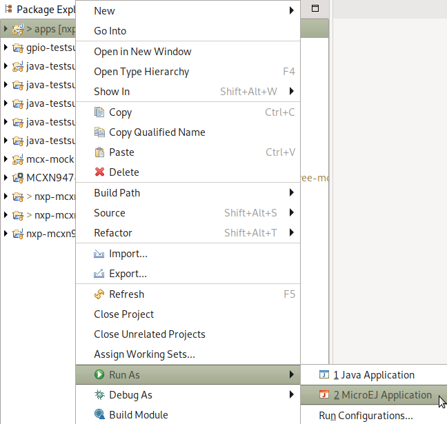


To run the application in simulation mode, select the mode _(SIM)_:


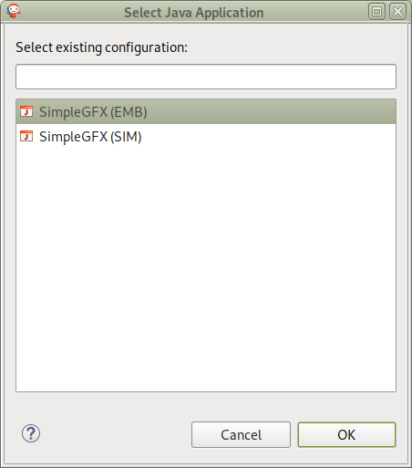


Here is the `SimpleGFX` application running in simulation:

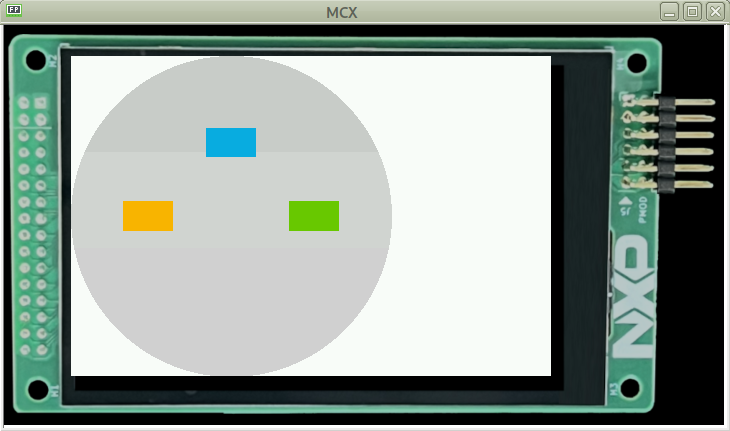


## Build and run applications on your MCXN947 Freedom board

### Get an evaluation license
A license is required to build an embedded application. 

A MicroEJ license is required to build high-level applications and the VEE Port for target hardware.

Evaluation licenses can be obtained for free. Please follow [the instructions from MicroEJ](https://docs.microej.com/en/latest/SDKUserGuide/licenses.html#evaluation-license).

With an evaluation license, you can build high-level applications with no limitation in simulation mode. However, applications built with an evaluation license will run for a limited time on target hardware.

Evaluation licenses must be renewed periodically (every month).

**Important note**: applications built with an evaluation license will freeze after a random period of time. A production license is necessary to have a fully working application on the target.


### Build the applications for target
With the MicroEJ SDK IDE, simply run the application the same way than [in simulation](#build-and-run-the-applications-in-simulation-mode) but by choosing the mode _(EMB)_.

#### Output of the build
The build will produce two artifacts:

* *microejapp.o*: the linked managed code application.
* *microejruntime.a*: the VEE core.

These artifacts are copied to the BSP project in the directory `projects/microej/platform/lib`.

### Build the firmware for target hardware using VS Code
#### vscode full solution compilation
vscode can compile, using cmake the full solution
Java application and the bsp
in order to do that you need to follow below instuctions to

- [Populate a Buildkit](#populate-a-build-kit)
- Export these two variables

on Linux
```
export MICROEJ_BUILDKIT_PATH_VAR=${HOME}/microej/BuildKit
export ECLIPSE_HOME_VAR=${HOME}/MicroEJ/MicroEJ-SDK-21.11/rcp/
```

On Windows
* Open the `Edit the system environment variables` application on Windows.
* Click on the `Environment Variables…` button.
* Click on the `New…` button under the `User variables` section.
* Set `Variable` Name to `MICROEJ_BUILDKIT_PATH_VAR`.
* Set `Variable Value` to the BuildKitdirectory
* Click on the `Ok` button until it closes `Edit the system environment variables` application.

same for `ECLIPSE_HOME_VAR`

#### vscode just bsp compilation
if you prefer to just build the BSP
change

```
  "cmake.sourceDirectory": "${workspaceFolder}/",
  "cmake.buildDirectory": "${workspaceFolder}/build/${buildType}",
```
into
```
  "cmake.sourceDirectory": "${workspaceFolder}/bsp/projects/nxpvee-ui/armgcc",
  "cmake.buildDirectory": "${workspaceFolder}/bsp/projects/nxpvee-ui/armgcc/build/${buildType}",
```

Once the application is ready, the firmware can be built using a C toolchain for Cortex-M.

#### Load the project into VS Code
Launch VS Code IDE and click on `File -> Add Folder to Workspace...`

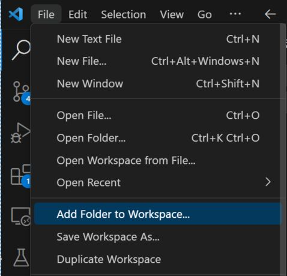

Navigate to the nxp-vee-mcxn947-frdm path then click `Add`.

From here you can compile and debug the project as any other C project.

To do so you need to configure then build the CMake project by following the steps below:

#### Scan for kits to locate all available toolchains
Open the Command Palette (`CTRL + SHIFT + p`) and run `CMake: Scan for kits`.

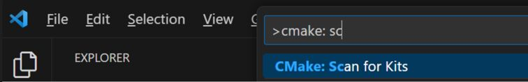

#### Select the toolchain that will build the project
Open the Command Palette (`CTRL + SHIFT + p`) and run `CMake: Select a kit`

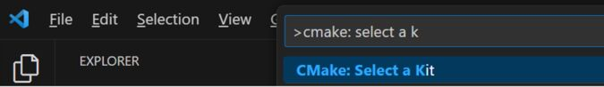

Choose the compiler `armgcc` in the path of your project.

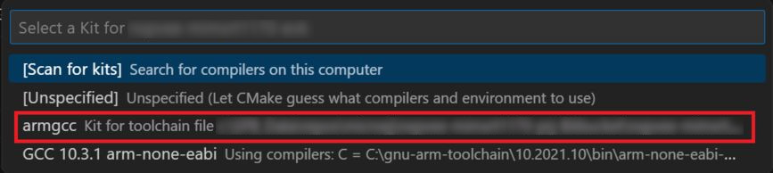

#### Select a build variant
Open the Command Palette (`CTRL + SHIFT + p`) and run `CMake: Select variant` to select the build mode you wish to use.
By default, you can select `flexspi_nor_sdram_debug` variant.

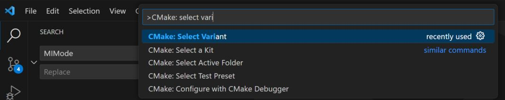

#### Configure the project
Open the Command Palette (`CTRL + SHIFT + p`) and run `CMake: Configure`.


#### Configure the bsp features
Edit settings.json and enable the desired feature
```
{
...
  "cmake.configureArgs": [
          "-DENABLE_NET=0",
          "-DENABLE_AI=0",
          "-DJMAIN=com.nxp.simpleGFX.SimpleGFX"
  ]
}
```
##### Enable NET
Set
```
"-DENABLE_NET=1",
```


##### Compile AI Demo
Set
```
"-DENABLE_AI=1",
"-DJMAIN=com.nxp.aiSample.AiMain"
```


#### Build the project
Open the Command Palette (`CTRL + SHIFT + p`) and run `CMake: Build`.


You can connect VS Code to the board using the Serial Link USB or using a SEGGER J-Link probe.
Follow the [Board Hardware User Guide](#board-setup) for more information on how to connect the different debuggers.

Debug session can be started by pressing the `F5` key.

It is also possible to build and debug the project via the MCUXpresso plugin:

Right click on the project nxp-vee-rt595, then:

* `Build Selected` to compile
* `Debug` to debug


Once the firmware is flashed, you should see the application running on the target.

#### <ins>Note:</ins>
In case of connection issue to the target, reset the debug probe selection via the MCUXpresso plugin:

* Select the MCUXpresso plugin in the left banner
* Right-click on the project name and select `Reset Probe Selection`
* Start the debug again


## Switching to a production license
To switch to a production license, please contact your NXP representative.

## Alternative: build and run from command line
This has only been tested on Linux.

A set of makefiles is provided to build either the whole project (VEE Port, high level application, firmware) or the final firmware from command line instead of using the MicroEJ / MCUXpresso IDE.
This can be useful for continuous integration or to get a more automated environment during development.

To access the top level makefile:
```
cd nxp-vee-mcxn947-frdm
```

### Requirements for building from command line

#### C toolchain
Make sure that the `ARMGCC_DIR` environment variable is set to the toolchain directory. 
If not, you must add it:

Linux:
```
export ARMGCC_DIR=/opt/gcc-arm-none-eabi-10.3-2021.10/
```

#### CMake
The build system used to generate the firmware is based on CMake.

Linux: to install CMake on a Debian based distro, run:
```
sudo apt install cmake
```

#### Make
Linux: to install GNU Make on a Debian based distro, run:
```
sudo apt install make
```

### Populate a Build Kit
It is necessary to export a Build Kit from the MicroEJ SDK IDE. This Build Kit is used by the makefile to build the VEE Port and the high level applications.

The Build Kit is bundled with the SDK and can be exported using the following steps:
```
    Select File > Export > MicroEJ > Module Manager Build Kit,
    Choose an empty Target directory, `i.e. ${HOME}/microej/BuildKit `
    Click on the Finish button.
```
### Using default evaluation license
Please follow  [Install the License Key](https://docs.microej.com/en/latest/SDKUserGuide/licenses.html#install-the-license-key) to be able to use make with an evaluation key

### Needed Environment variables
In order to compile correctly you will need to export

```
export MICROEJ_BUILDKIT_PATH_VAR=${HOME}/microej/BuildKit
export ECLIPSE_HOME_VAR=${HOME}/MicroEJ/MicroEJ-SDK-21.11/rcp/
```

you can also specify a partial repository, when needed (for example if you need libraries that are not yet public)
```
export MODULE_REPOSITORY_SETTINGS_FILE_VAR=${HOME}/microej/microej-partial-repository/ivysettings.xml
```

if you are using LinkServer to flash your board, append your path with the following command:
```
export PATH=$PATH:/usr/local/LinkServer_1.3.15/binaries/
```

#### <ins>Note:</ins>
Use full path names in above environment variables, do not use special character `~` to represent your home directory.

### Explore available options (works on Linux)
```
make <TAB>

# will get you
clean                        # clean all projects
nxpvee-ui-clean              # clean UI project
nxpvee-ui-gdb                # debug UI project using gdb and jlink
nxpvee-ui-java_run           # run simulation, you can override java main using MAIN=com.nxp.animatedMascot.AnimatedMascot make nxpvee-ui-java_run
nxpvee-ui-flash              # flash board using jlink
nxpvee-ui-gdb_cmsisdap       # debug UI project using gdb and CMSIS
nxpvee-ui.prj                # build complete UI project
nxpvee-ui-flash_cmsisdap     # flash board using CMSIS
nxpvee-ui-java_rebuild       # rebuild java app
nxpvee-validation.prj        # compile and run validation
```

### compile and flash
```
make nxpvee-ui.prj

# flash with a J-Link probe
make nxpvee-ui-flash

# or flash with USB using CMSIS-DAP
make nxpvee-ui-flash_cmsisdap
```

### Compilation defaults
Demo app is compiled with
- NET
- SSL
by default

### compile with just NET support enabled
```
make nxpvee-ui.prj CMAKE_OPTS="-DENABLE_NET=1"
```


### compile Ai demo
```
make nxpvee-ui.prj CMAKE_OPTS="-DENABLE_AI=1" MAIN=com.nxp.aiSample.AiMain
```


### debug
```
make nxpvee-ui-gdb
# or
make nxpvee-ui-gdb_cmsisdap
```

### Ninja
to speed up compilation you can use ninja instead of make
```
MAKE=ninja make nxpvee-ui.prj
```

### Compile Release image
to compile release image you can
```
make nxpvee-ui.prj RELEASE=1
```

### Compile using production license
to compile using a production license, a dongle is needed
```
make nxpvee-ui.prj USAGE=prod
```


### Compiling using west
It is possible to compile the whole Java app and the BSP using west

```
west build
```

#### To compile in verbose mode
```
west build -- -DVERB=1
```

#### To compile in production mode
```
west build -- -DJUSAGE=prod
```

#### To compile the AI example

```
 west build -- -DJMAIN=com.nxp.aiSample.AiMain -DENABLE_AI=1
```


#### To compile the with net support
```
 west build -- -DENABLE_NET=1
```

#### To flash using jlink
```
west flash
```

#### To debug using jlink/gdb
```
west debug
```


## Tutorial: Using native C functions from the high level application
Some functions directly used by the high-level application can be implemented in C. It is called the [Native Interface Mechanism](https://docs.microej.com/en/latest/VEEPortingGuide/native.html).

A native method is declared in the Application but is implemented in the native world. So a native declaration requires a C and Java implementation for the Simulator. You can find an example of a native method on [this page](https://docs.microej.com/en/latest/VEEPortingGuide/sni.html?highlight=native#example).

You can have custom natives specific to the Java application (less portable between VEE Ports but fast execution). On the other hand, you can use native methods provided by [Foundation Libraries](https://docs.microej.com/en/latest/glossary.html#term-Foundation-Library) (Portable between VEE Ports but takes more time at the execution). 

The SimpleGFX application uses of C native function to calculate rectangles' coordinates (mainly for demonstration's sake).

### Declaring and using native functions in the Java world
It is recommended to store all your native methods in the same public class. This public class contains methods with the same parameters as the C native functions.

The name of the C function is `Java_<package_name>_<class_name>_<method_name>`. Any underscore (`_`) character in `package_name`, `class_name`, or `function_name` is replaced by `_1`. Dots (`.`) are replaced by underscores `_`.

For these reasons, it is handy to stick to Java naming conventions and use camel case for class and method names and lowercase only package names.

For example:
````
package com.nxp.application;

public class MyClassNatives {
	/* package */ native static int NativeFunction(int a);
};
````

This can be used in the application source code this way:
````
j = MyClassNatives.NativeFunction(i);
````

### Implementing the native functions in C world
The native functions are implemented in C, with a name deriving from the package name and the native class name.
In the previous example, we would have:
````
int Java_com_nxp_application_MyClassNatives_NativeFunction(int a)
{
    int i;

[...]

    return i;
}
````

When you implement a native method, it is recommended to use the type of `sni.h` rather than the native type. This ensures type consistency between Java and C. 
You could use `jint` instead of `int` in the example above.

The `sni.h` file is located on `nxp-vee-mcxn947-frdm/bsp/projects/microej/platform/inc` folder.

### Implementing a mockup of the native functions for the simulator
Mockup functions are used to simulate the behavior of native functions when using the MicroEJ SDK Simulator. Mockups are detailed in the [MicroEJ website](https://docs.microej.com/en/latest/PlatformDeveloperGuide/mock.html).

They are implementated in a different MicroEJ SDK project (`microej/mock`).

The name of the file containing the mockup functions is supposed to be the same as the one where the native functions are declared in the application project (e.g. `SimpleGFXNatives.java`).

The file may look like this:
````
package com.nxp.application;

public class MyClassNatives {
    static int NativeFunction(int a) {
        int i;

        [...]

        return i;
    }
};
````

Please note that this project mockup must be added as a dependency inside the VEE Port's `module.ivy` file. The `module.ivy` file is located in the `microej/vee-port-configuration` folder. You will find inside all the dependencies used by the VEE Port.  


The `org` and `name` fields can be found inside the mockup's `module.ivy` file (respectively `organisation` and `module`):


After any modification to the mockup project, you need to rebuild the mock (right click on the mock project and select `Build Module`) and the platform (see [Build the platform](#build-the-vee-port)).

## Get familiar with MICROEJ

To discover insights about MicroEJ technology, please follow some of the entry points below. In addition, you will find useful links to our documentation and our GitHub. 

### Examples

You can try to run other examples on our VEE Port. Here is an exhaustive list of them so that you can go further in the MicroEJ technology:

* [Understand How to Build a Firmware](https://docs.microej.com/en/latest/Tutorials/tutorialUnderstandMicroEJFirmwareBuild.html): It is a document that describes the components, their dependencies, and the process involved in the build of a Firmware.
* [Get Started With GUI](https://docs.microej.com/en/latest/Tutorials/getStartedWithGUI/index.html): It is a guided tutorial to get the basics concepts of our UI.
* [Github resources](https://github.com/MicroEJ):
    * How to use [foundation libraries](https://github.com/MicroEJ/Example-Standalone-Foundation-Libraries) on the Virtual Device or on board.
    * Various examples of [how-to's](https://github.com/MicroEJ/How-To).
    * Some [Demo projects](https://github.com/orgs/MicroEJ/repositories?q=demo&type=all&language=&sort=).


### MICROEJ Documentation

You can take a look at the MICROEJ development documentation. 
Below you can find some important chapters:
* [Application Developer Guide](https://docs.microej.com/en/latest/ApplicationDeveloperGuide/index.html): It covers concepts essential to MicroEJ Applications design.
* [MICROEJ VEE Port Developer Guide](https://docs.microej.com/en/latest/VEEPortingGuide/index.html): It covers the main process and configuration of a MicroEJ VEE.
* [Tutorials](https://docs.microej.com/en/latest/Tutorials/index.html#): There are multiple tutorials to master different subjects about the MicroEJ environment (including UI development, code quality and debug, CI/CD…).

## Troubleshooting

### License Error when building application

#### [M65] - License check failed

If you have the following error `[M65] - License check failed [tampered (3)]`, please follow the steps on this [page](https://forum.microej.com/t/license-check-fail-workaround-on-microej-sdk-with-jdk-version-8u351/1182)


