# NXP Platform Accelerator for MCXN947 FRDM v2.0.0

This project is used to build NXP Platform Accelerator for the [MCXN947 FRDM](https://www.nxp.com/design/design-center/development-boards/general-purpose-mcus/frdm-development-board-for-mcx-n94-n54-mcus:FRDM-MCXN947) with a display panel [LCD_PAR_S035](https://www.nxp.com/design/design-center/development-boards/general-purpose-mcus/3-5-480x320-ips-tft-lcd-module:LCD-PAR-S035).

<p float="left">
  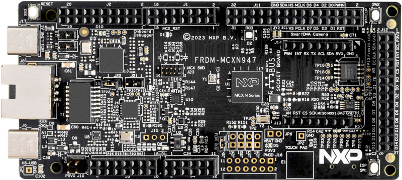
  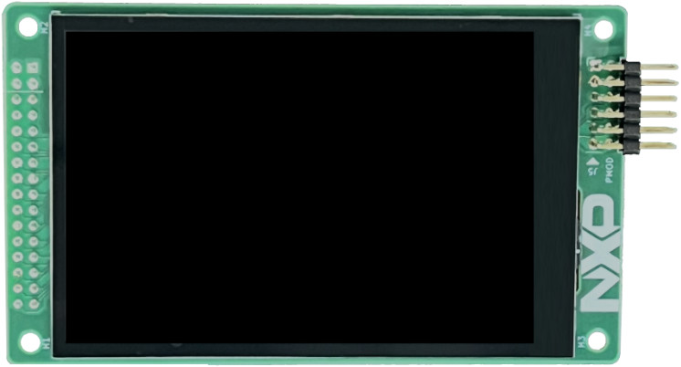 
</p>

NXP Platform Accelerator is a VEE (Virtual Execution Environment) that provides a hardware abstraction to develop applications in high-level programming languages such as Java.

NXP Platform Accelerator is built upon [MicroEJ technology](https://www.microej.com/product/vee/).

## Description

### Board Technical Specifications

|                         |               |
| ----------------------- | ------------- |
|MCU part number          |MCXN947        |
|MCU architecture         |Arm Cortex-M33 |
|MCU max clock frequency  |150 MHz        |
|Internal RAM size        |512kB          |
|Internal flash size      |1MB - 2MB      |
|eMMC/SD support          |yes            |
|Display                  |480x320 LCD    |
|Ethernet interface       |yes            |

### BSP (Board Support Package)

The BSP is based on the following versions:

* [MCUXpresso SDK](https://mcuxpresso.nxp.com/en/welcome) `2.16.000` for MCXN947 FRDM board
* [FreeRTOS](https://www.freertos.org/index.html) version `11.0.1`

### VEE Port Specifications

The architecture version is `8.3.0`.

This VEE Port provides the following Foundation Libraries:

|Foundation Library|Version|
|------------------|-------|
|AI                |1.0    |
|BON               |1.4    |
|DEVICE            |1.2    |
|DRAWING           |1.0    |
|EDC               |1.3    |
|FS                |2.1    |
|GPIO              |1.0    |
|KF                |1.7    |
|MICROUI           |3.1    |
|NET               |1.1    |
|SECURITY          |1.4    |
|SNI               |1.4    |
|SSL               |2.2    |
|TRACE             |1.1    |

This VEE Port is compatible with MicroEJ SDK6 or higher.

## Requirements

* A PC with Windows 10 or higher or Linux (tested on Debian 11),
  * Note for Mac users: this documentation does not cover MacOS use; however, it is supported by the MicroEJ tools. If you are interested in Mac support, please [contact MicroEJ](https://www.microej.com/contact/#form_2).
* An internet connection to use the [MicroEJ Central Repository](https://developer.microej.com/central-repository/),
* An MCXN947 FRDM board (can be ordered [here](https://www.nxp.com/design/design-center/development-boards/general-purpose-mcus/frdm-development-board-for-mcx-n94-n54-mcus:FRDM-MCXN947)) and LCD_PAR_S035 display panel (can be ordered [here](https://www.nxp.com/design/design-center/development-boards/general-purpose-mcus/3-5-480x320-ips-tft-lcd-module:LCD-PAR-S035))
* Optionally: a J-Link Debugger probe to flash the software.
* Optionally: a MicroSD card to use the file system
  * SDCard slot can be missing, see [troubleshoot section](#microsd-card-could-be-missing)

## Preliminary Steps

### Get MicroEJ SDK

The MICROEJ SDK allows to build the VEE Port and the high-level applications.
It can be used to run the MCXN947 FRDM simulator.

* Install a Java Development Kit (JDK). The MICROEJ SDK requires a JDK (Java Development Kit) 11 or higher.
  You can download a JDK at [Java SE 11](https://www.oracle.com/java/technologies/downloads/#java11).
* Install MICROEJ SDK 6 by following the [SDK 6 Installation Documentation](https://docs.microej.com/en/latest/SDK6UserGuide/install.html).
  You can use your preferred IDE to work with the MICROEJ SDK.

This release has been tested with a JDK 11 and 17.

### Get the Necessary Tools for MCUXpresso SDK

You can choose to install MCUXpresso SDK tools manually or with the installer tool.

#### With the MCUXpresso Installer Tool

Install the MCUXpresso Installer tool with the following documentation: [link](https://github.com/nxp-mcuxpresso/vscode-for-mcux/wiki/Dependency-Installation).

Open it and install the following tools that are used during compilation/debugging:

* MCUXpresso SDK Developer (installs CMake, Ninja, West, and ARM GNU Toolchain)
* LinkServer
* SEGGER J-Link (if optional J-Link is used)

Also, install the following tools manually:

* [Make](https://gnuwin32.sourceforge.net/packages/make.htm), in version 3.81 or higher.
* On Ubuntu 22.04 or lower, [CMake](https://cmake.org/download/) must be installed manually to get the latest version (3.27 or higher needed).

#### Manual Installation

The MCUXpresso installer tool provides a convenient way to install these tools, but they can also be installed independently.
In the case of a standalone installation, the following versions need to be installed:

* [CMake](https://cmake.org/download/) version 3.27 or higher
* [Make](https://gnuwin32.sourceforge.net/packages/make.htm) version 3.81 or higher
* [ARM GNU Toolchain](https://developer.arm.com/downloads/-/arm-gnu-toolchain-downloads) version 13.2.1 or higher
* [LinkServer](https://www.nxp.com/design/design-center/software/development-software/mcuxpresso-software-and-tools-/linkserver-for-microcontrollers:LINKERSERVER) version 1.6.133 or higher

#### Environment Variables

Whatever procedure is used for the installation, the following environment variables must be configured:

* ``ARMGCC_DIR``: the installation directory of ARM GNU Toolchain, for example ``C:\Program Files (x86)\Arm GNU Toolchain arm-none-eabi\13.2 Rel1``
* If you use LinkServer to flash your device, add to ``PATH`` the installation directory of LinkServer, for example ``C:\NXP\LinkServer_24.12.21``.

> Note: On Windows, editing the User variables may not work —Preferably edit System variables.


## Fetch the Source Code

Clone the repository with the following commands:

```bash
mkdir nxp-vee-mcxn947-frdm
cd nxp-vee-mcxn947-frdm
west init -m https://github.com/nxp-mcuxpresso/nxp-vee-mcxn947-frdm.git .
west update
```

The following repositories will be created:

```text
.west nxp-vee-mcxn947-frdm
```

> Note: On Windows, your path to the repository folder should be as short as possible

> Note: Your path should not contain a whitespace or special character

## Open the Project

Launch your IDE chosen during MicroEJ installation step and open the project folder (`nxp-vee-mcxn947-frdm`). The following screenshots show Visual Studio Code, but similar results can be obtained with another IDE.

<p float="left">
  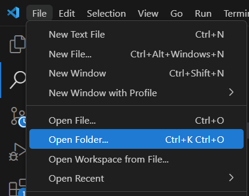
</p>

Then wait for your IDE to finish loading the project, as indicated in the message in the status bar:

<p float="left">
  
</p>

Once loaded, you should see the following files and folders:

<p float="left">
  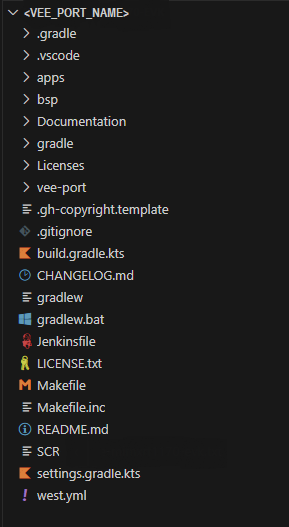
</p>

And the Gradle view should look like this:

<p float="left">
  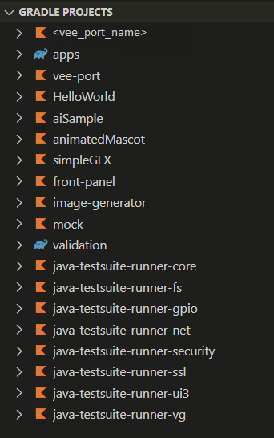
</p>

## Build and Run an Application in Simulation Mode

### Choose your Demo Application

Following MicroEJ applications are included in this release.

* The `SimpleGFX` application displays three moving rectangles using the [MicroUI API](https://docs.microej.com/en/latest/ApplicationDeveloperGuide/UI/MicroUI/index.html#section-app-microui). The coordinates of the rectangles are calculated in C native functions. More details in [this README](apps/simpleGFX/README.md).
* The `AiSample` Application runs an inference of sample images on a CifarNet quantized TensorFlow Lite model. You can find the AI library API in the [MicroEJ Developer Repository](https://forge.microej.com/ui/native/microej-developer-repository-release/com/nxp/api/ai/). To run this demo, AI must be enabled (see [AI](#ai) paragraph). More details in [this README](apps/aiSample/README.md).

### Execute runOnSimulator Task

To run an application in simulation mode, go to the Gradle view, expand the tasks of the chosen demo project, then double-click on the `microej` > `runOnSimulator` task:

<p float="left">
  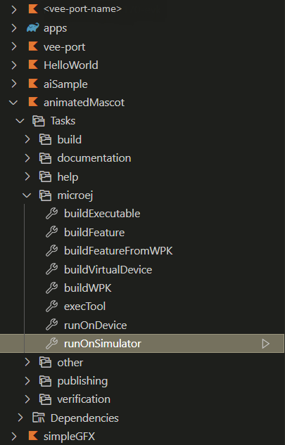
</p>


The runOnSimulator task also builds the VEE Port declared as dependency if required.

## Build and Run Applications on your Board

### Board Setup

Plug the USB port "JTAG" of your board to your computer with a USB-C cable.

The USB connection is used as a serial console for the SoC, as a CMSIS-DAP debugger, and as a power input for the board.

The MicroEJ VEE Port uses the virtual UART from the MCXN947 FRDM USB port. A COM port is automatically mounted when the board is plugged into a computer using a USB cable. All board logs are available through this COM port.

The COM port uses the following parameters:

| Baudrate | Data bits bits | Parity bits | Stop bits | Flow control |
| -------- | -------- | -------- | -------- | -------- |
| 115200     | 8     | None     | 1     | None     |

Here is a picture of MCXN947 board connected with:
 - The USB wire plugged on J17,
 - The optional J-Link Debugger probe on J23.
<p float="left">
  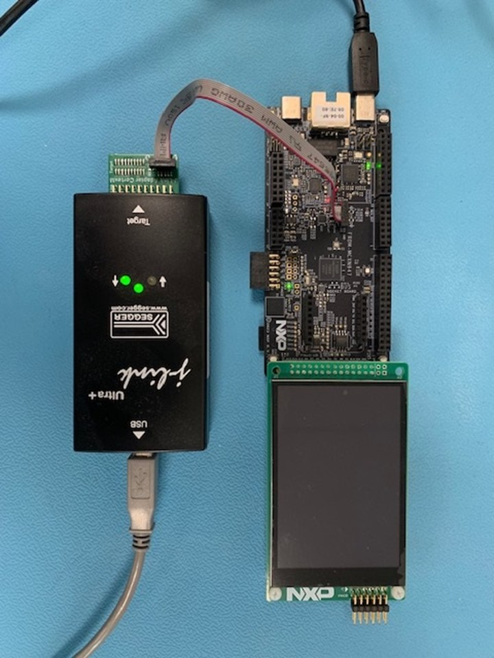
</p>

### Build and Deploy

There are two different ways to build and deploy an executable on target:

* Using MicroEJ SDK 6: this method allows to build and deploy an executable in one click using gradle tasks.
* Using MCUXpresso for VSCode: this method allows to debug on target in addition to build and deploy.

#### Build and Deploy using MicroEJ SDK 6


##### Configure debug or release mode

To configure the debug or release mode, change the `CHOSEN_MODE` variable in [set_project_env.bat](bsp/vee/scripts/set_project_env.bat) or [set_project_env.sh](bsp/vee/scripts/set_project_env.sh):

* Set it to `0` for debug mode
* Set it to `1` for release mode

##### Configure the debug probe

To configure the debug probe, change the `CHOSEN_PROBE` variable in [set_project_env.bat](bsp/vee/scripts/set_project_env.bat) or [set_project_env.sh](bsp/vee/scripts/set_project_env.sh):

* Set it to `flash` for a J-Link probe
* Set it to `flash_cmsisdap` for board internal probe

##### Configure the BSP Features

Compilation flags are located in [CMakePresets.json](bsp/vee/scripts/armgcc/CMakePresets.json).
To enable any desired features, please edit the file.

For changes in this file to take effect, the script [clean.bat](bsp/vee/scripts/clean.bat) or [clean.sh](bsp/vee/scripts/clean.sh) must be called.

##### Launch `runOnDevice` gradle task

To build and deploy your executable on your board, go to the Gradle view, expand the tasks of the chosen demo project, then double-click on the `microej` > `runOnDevice` task:

If you don't have a MicroEJ license, you will get an error message telling you to get one. Please follow [the instructions from MicroEJ](https://docs.microej.com/en/latest/SDK6UserGuide/licenses.html#evaluation-licenses) to get an evaluation license. To switch to a production license, please get in touch with your NXP representative.

This task calls:

* [build.bat](bsp/vee/scripts/build.bat) or [build.sh](bsp/vee/scripts/build.sh) to build the BSP,
* [run.bat](bsp/vee/scripts/run.bat) or [run.sh](bsp/vee/scripts/run.sh) script to flash the program on the target without opening a debug session.

<p float="left">
  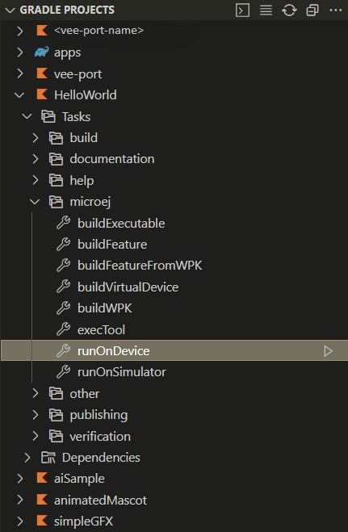
</p>

#### Build and Deploy using MCUXpresso for VSCode

MCUXpresso for VSCode is a plugin on VSCode IDE that builds and deploys firmware on NXP targets. It also provides the configuration to launch a debug session.

##### Generate MicroEJ Object Files

You need to produce the object files of the MicroEJ Application and deploy them into the BSP, but you will delegate the build of the Executable to MCUXpresso. To do so, follow these steps:

* Open the file `configuration/common.properties` located in your application folder and change the property `deploy.bsp.microejscript` to `false`
* Open the Gradle view, expand the tasks of your application, and double-click on the `microej` > `buildExecutable` task.

The following MicroEJ object files will be deployed in the BSP:

* The MicroEJ application (`microejapp.o`) will be deployed in `bsp/vee/lib`.
* The MicroEJ library (`microejruntime.a`) will be deployed in `bsp/vee/lib`.
* The MicroEJ header files (`*.h`) will be deployed in `bsp/vee/inc`.

##### Load the Project into VS Code

Open the project with VSCode (from where the .vscode is located).
Install [MCUXpresso for VSCode](https://www.nxp.com/design/design-center/software/embedded-software/mcuxpresso-for-visual-studio-code:MCUXPRESSO-VSC) plugin.

##### Select a Preset

Open the Command Palette (`CTRL + SHIFT + p`) and run `CMake: Select Configure Preset` to select the build mode you wish to use.

By default, you can select the `debug` variant.

<p float="left">
  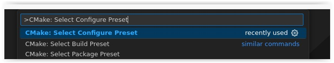
</p>

You can also select a preset by using the Projects section from the "MCUXpresso for VS code" view and setting the appropriate build as default.

<p float="left">
  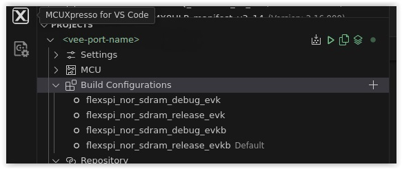
</p>

##### Configure the Project

Open the Command Palette (`CTRL + SHIFT + p`) and run `CMake: Configure`.

<p float="left">
  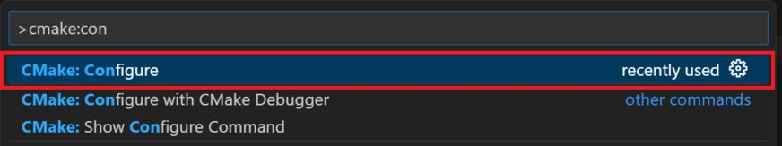
</p>

##### Configure the BSP Features

Compilation flags are located in [CMakePresets.json](bsp/vee/scripts/armgcc/CMakePresets.json).
To enable any desired features, please edit the file (and reload preset & re-configure if needed).

After a change in this file, a Pristine build must be made (see [Build the Project](#build-the-project) step).

##### Build the Project

Open the Command Palette (`CTRL + SHIFT + p`) and run `CMake: Build`.

<p float="left">
  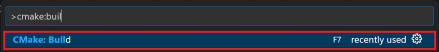
</p>

You can connect VS Code to the board using the Serial Link USB or a SEGGER J-Link probe.
Follow the [Board Setup](#board-setup) step for more information on how to connect the different debuggers.

Debug sessions can be started by pressing the `F5` key.

It is also possible to build and debug the project via the MCUXpresso plugin:

Right-click on the project, then:

* `Build Selected` or `Pristine Build/Rebuild Selected` to compile.
* `Debug` to debug (it can take some time before launching). In this case, the name of the selected preset must contain `debug` and not `release`.

<p float="left">
  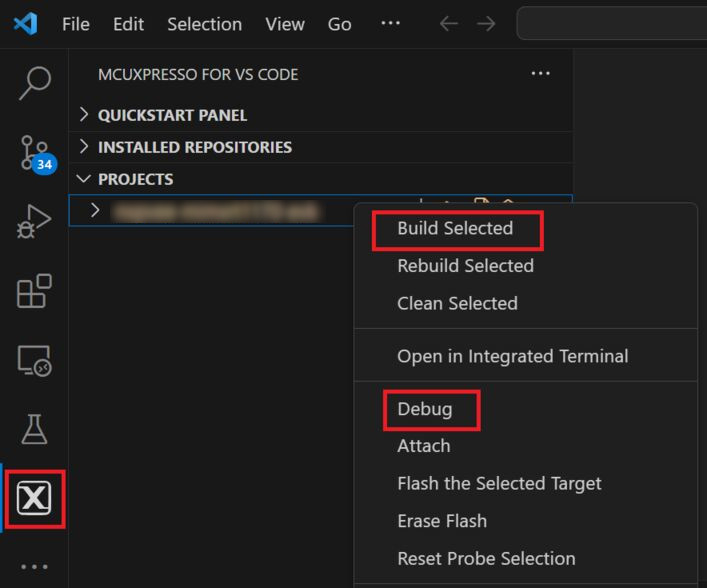
</p>

Once the firmware is flashed, you should see the application running on the target.

<ins>Note:</ins>
In case of connection issues to the target, reset the debug probe selection via the MCUXpresso plugin:

* Select the MCUXpresso plugin in the activity bar.
* Right-click on the project name and select `Reset Probe Selection`.
* Start the debug again.

<p float="left">
  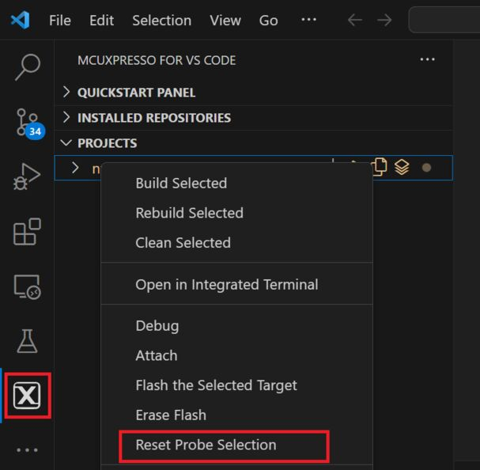
</p>

## Optional Features

### Multi-Sandbox

For information on multi-sandbox, please visit [MicroEJ website](https://docs.microej.com/en/latest/VEEPortingGuide/multiSandbox.html).

By default, the VEE Port is built in mono-sandbox. Multi-sandbox can be enabled by editing `com.microej.runtime.capability` property of [configuration.properties](vee-port/configuration.properties) file and change its value to `multi`.

### AI

AI can be enabled or disabled by changing `ENABLE_AI` value in [CMakePresets.json](bsp/vee/scripts/armgcc/CMakePresets.json).
Set it to 1 to enable it and 0 to disable it.
Call [clean.bat](bsp/vee/scripts/clean.bat) or [clean.sh](bsp/vee/scripts/clean.sh) after changing this value.
### System View

For information about System View, please visit [SEGGER website](https://www.segger.com/products/development-tools/systemview/) or [MicroEJ documentation](https://docs.microej.com/en/latest/VEEPortingGuide/systemView.html#microej-core-engine-os-task).

Follow these steps to run a System View live analysis:

* Set `ENABLE_SYSTEM_VIEW` CMake variable to 1 in [CMakePresets.json](bsp/vee/scripts/armgcc/CMakePresets.json).
* Call [clean.bat](bsp/vee/scripts/clean.bat) or [clean.sh](bsp/vee/scripts/clean.sh).
* Set `FLASH_CMD` to `flash` in [set_project_env.bat](bsp/vee/scripts/set_project_env.bat) or [set_project_env.sh](bsp/vee/scripts/set_project_env.sh).
* Execute `runOnDevice` gradle task. Use a J-Link probe to flash your target.
* Open System View PC application
* Go to Target > Start Recording
* Select the following Recorder Configuration:
  * J-Link Connection = USB
  * Target Connection = MCXN947_M33_0
  * Target Interface = SWD
  * Interface Speed (kHz) = 4000
  * RTT Control Block Detection = Auto
* Click Ok

If you have an issue, please have a look at the [Troubleshooting section](https://docs.microej.com/en/latest/VEEPortingGuide/systemView.html#troubleshooting) in MicroEJ documentation.


## Troubleshooting

### Setup Error

#### West Update and "Filename too long" Issue

On Windows, fetching the source code may trigger the following fatal error:
```error: unable to create file [...]: Filename too long.```

To avoid this, git configuration needs to be updated to handle long file names:

Start Git Bash as Administrator.

Run the following command:
```git config --system core.longpaths true```

#### West Update and "PermissionError: [WinError 5] Access is denied" Issue

If you get the error `PermissionError: [WinError 5] Access is denied`, please consider the following procedure :

```bash
rm .west
cd nxp-vee-mcxn947-frdm
west init -l
cd ..
west update
```

### Ninja errors during BSP build

#### Ninja: error: loading 'build.ninja': The system cannot find the file specified

If you get the following error during the BSP build, please remove the cmake cache by running the script [clean.bat](bsp/vee/scripts/clean.bat) or [clean.sh](bsp/vee/scripts/clean.sh).

```text
"Failed to build the firmware"
ninja: error: loading 'build.ninja': The system cannot find the file specified.
make: *** [remake] Error 1
```

### Flash issue

Flash may not work out of the box.
If this is the case, please:
 - Check if correct probe is chosen based on effective flash method
 - Update firmware of the on-board debugger (that may not be up-to-date)

See [this community post](https://community.nxp.com/t5/MCUXpresso-IDE/FRDM-MCXN947/m-p/1819980/highlight/true#M9559) on how to update the firmware for MCXN947 FRDM.


### MicroSD card could be missing

MCXN947 FRDM boards do not come with a MicroSD card socket populated on J12.

If File System is needed, a MicroSD memory card connector can be soldered like MEM2075-00-140-01-A from GLOBAL CONNECTOR TECHNOLOGY INC),
(see https://community.nxp.com/t5/MCX-Microcontrollers/FRDM-MCXN947-SD-Card-Slot-Part-Number/m-p/2024781)

